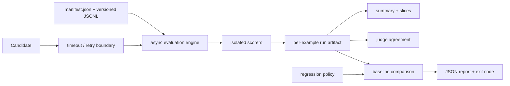

# evalreliability

A local-first Python evaluation harness for making stochastic model and agent behavior testable with production-software rigor.

`evalreliability` preserves per-example execution evidence, treats partial failures as structured data, derives reliability and quality summaries, and turns explicit regression policy into machine-checkable CI behavior.

It supports deterministic fixture evaluation and opt-in local model execution through the Claude Code CLI using the same asynchronous candidate interface.

## Core capabilities

* Versioned JSONL datasets with strict manifests, unique example IDs, path confinement, and canonical SHA-256 dataset identity.
* Provider-independent asynchronous `Candidate` interfaces with typed failures, per-attempt timeouts, bounded exponential backoff, seeded jitter, and retained attempt history.
* Deterministic fixture candidates for reproducible CI.
* An opt-in Claude Code CLI candidate with tools disabled, explicit runtime configuration, temporary-directory isolation, and normalized provider metadata.
* Independent scorers for normalized exact match, required terms, JSON Schema, expected JSON fields, lexical/layout constraints, and candidate-backed judging.
* Bounded concurrent evaluation with isolation at both example and scorer boundaries.
* Structured run artifacts containing candidate attempts, outputs, failures, usage, latency, environment, configuration, and Git provenance.
* Derived reliability, failure-taxonomy, latency, scorer, and slice summaries.
* Baseline/candidate regression comparison with aggregate, slice, reliability, sample-size, and per-example policy gates.
* Judge/reference agreement analysis with coverage, confusion matrices, Cohen's kappa, disagreement records, slice metrics, and provenance metadata.
* Resumable single-annotator reference collection and aligned candidate/judge/reference analysis.
* A strict JSON-configured CLI and path-confined local FastAPI interface.
* Deterministic tests covering execution, retries, timeouts, malformed outputs, evaluator failures, concurrency, artifacts, API confinement, and regression behavior.

## Quickstart

Python 3.11 or newer is required.

```bash
python3 -m venv .venv
source .venv/bin/activate
python -m pip install -e '.[dev]'

evalrel validate-dataset examples/datasets/core/v1

evalrel run examples/configs/baseline.json \
  --output /tmp/baseline.run.json \
  --summary-output /tmp/baseline.summary.json

evalrel run examples/configs/candidate.json \
  --output /tmp/candidate.run.json \
  --summary-output /tmp/candidate.summary.json

evalrel compare \
  --baseline /tmp/baseline.run.json \
  --candidate /tmp/candidate.run.json \
  --policy examples/configs/regression-policy.json \
  --output /tmp/comparison.json
```

The comparison command returns:

* `0` when regression policy passes;
* `3` when a quality or reliability gate fails;
* `1` for invalid configuration, invalid artifacts, or another operational error.

Command-usage errors use argparse's conventional exit status `2`.

## Architecture



Dataset loading, invocation policy, candidate execution, scoring, serialization, analysis, and regression policy are separate package boundaries.

See [`docs/design.md`](docs/design.md) for the detailed contracts and trade-offs.

## Failure-aware evaluation

The engine distinguishes execution failure from quality failure.

| Observation                                        | Classification | Retry behavior             | Example status      |
| -------------------------------------------------- | -------------- | -------------------------- | ------------------- |
| Typed refusal or provider failure                  | model/provider | adapter policy             | failed if exhausted |
| Candidate timeout or retryable adapter failure     | infrastructure | within retry policy        | failed if exhausted |
| Malformed candidate JSON scored by a schema scorer | quality result | no candidate retry         | completed           |
| Judge output violating its scorer contract         | evaluator      | judge invocation may retry | partial             |
| Scorer exception or scorer timeout                 | evaluator      | no scorer retry            | partial             |

A failed score does not automatically invalidate the rest of an evaluation.

For example, one scorer can record malformed JSON while other scorers continue evaluating the same candidate response. Cancellation propagates to the caller rather than being converted into an ordinary result.

## Dataset contract

A dataset contains a manifest plus versioned JSONL records.

```json
{
  "schema_version": "1",
  "dataset_id": "support-routing",
  "version": "1.0.0",
  "data_file": "data.jsonl",
  "provenance": "How examples and labels were obtained"
}
```

Example record:

```json
{
  "id": "ticket-001",
  "input": "...",
  "expected": {
    "text": "..."
  },
  "metadata": {
    "slices": {
      "domain": "support"
    }
  }
}
```

Configuration is also JSON so unknown fields and ambiguous values fail during loading rather than later in execution.

Paths are resolved relative to the configuration file.

## Candidates

Candidates can represent:

* one model call;
* a tool-using agent;
* a retrieval pipeline;
* a complete workflow;
* replay of previously captured outputs.

All candidates implement the same asynchronous interface.

```python
from evalreliability.candidates import Candidate
from evalreliability.models import CandidateRequest, CandidateResponse, Usage


class MyCandidate(Candidate):
    @property
    def identifier(self) -> str:
        return "my-system@revision"

    def configuration(self) -> dict[str, object]:
        return {
            "provider": "example",
            "temperature": 0,
        }

    async def generate(
        self,
        request: CandidateRequest,
    ) -> CandidateResponse:
        result = await call_my_system(request.input)

        return CandidateResponse(
            output=result.text,
            model_id=result.model,
            usage=Usage(
                input_tokens=result.input_tokens,
                output_tokens=result.output_tokens,
            ),
        )
```

Expected provider/model failures use `CandidateError` with explicit failure origin and retryability.

Unexpected adapter exceptions are normalized as infrastructure failures.

Candidate configuration is retained in run provenance and should contain no secrets.

## Scorers

Scorers run independently against candidate output.

Built-in scoring covers:

* normalized exact match;
* required terms;
* JSON Schema;
* expected JSON fields;
* textual and layout constraints;
* candidate-backed judge evaluation.

A normal quality miss produces `ScoreOutcome.FAIL`.

A scorer that cannot produce a valid evaluation raises `EvaluatorError`, allowing the run to preserve the distinction between candidate quality and evaluator failure.

## Run artifacts

Run artifacts are the durable execution record.

Per-example evidence can include:

* candidate attempts;
* final candidate response;
* normalized failures;
* scorer results;
* measured latency;
* token usage;
* provider-reported cost;
* provider metadata.

Run-level metadata includes:

* dataset identity;
* candidate configuration;
* scorer configuration;
* evaluation configuration;
* run ID;
* configuration fingerprint;
* environment information;
* Git provenance.

Artifacts are written through a temporary file followed by flush, `fsync`, and atomic replacement.

Summaries and comparisons are derived from run artifacts and can be regenerated.

```bash
evalrel summarize examples/artifacts/candidate.run.json

evalrel compare \
  --baseline examples/artifacts/baseline.run.json \
  --candidate examples/artifacts/candidate.run.json \
  --policy examples/configs/regression-policy.json
```

## Regression policy

Regression comparison can gate:

* aggregate metrics;
* reliability;
* slices;
* measured coverage;
* sample size;
* individual examples.

A policy failure produces a structured comparison artifact and exit status `3`, making the same analysis suitable for local inspection and CI regression gates.

The checked deterministic example intentionally includes a required-term regression so the comparison path retains and evaluates negative evidence rather than only demonstrating passing cases.

## Replay

A `run_artifact` candidate can replay successful responses from an immutable prior run.

This is useful when a later judge or analysis step must evaluate the exact output observed in an earlier experiment instead of generating a new stochastic response.

Dataset checksums must match before replay is accepted.

## Claude Code CLI transport

The repository includes an opt-in Claude Code CLI candidate.

A minimal smoke configuration is available at:

`examples/configs/real/claude-sonnet-smoke.json`

Example:

```bash
evalrel run examples/configs/real/claude-sonnet-smoke.json \
  --output /tmp/claude-sonnet-smoke.run.json \
  --summary-output /tmp/claude-sonnet-smoke.summary.json
```

The adapter executes the configured `claude` executable with a single-turn JSON interface, disabled tools, reduced dynamic context, and a fresh temporary working directory.

It captures provider-reported response metadata, usage, model identifiers, cost, duration, and TTFT when available.

Authentication remains with the existing local Claude CLI session.

Transport errors, authentication failures, timeouts, malformed envelopes, provider errors, and other nonzero process exits are represented with distinct failure evidence.

Deterministic CI does not invoke this transport.

## Judge experiments

Two checked experiments exercise the model-judge path.

### `judge-calibration-v1`

[`experiments/judge-calibration-v1`](experiments/judge-calibration-v1/README.md) contains 16 project-authored instruction-following cases, frozen Haiku responses, an assisted/operator reference set, and blinded Sonnet judge attempts.

Fifteen judge outputs satisfied the strict verdict contract and matched the corresponding assisted/operator references. One judge output contained malformed JSON and remains recorded as invalid rather than repaired.

The experiment README records the exact provenance, model identifiers, usage, case-level results, and interpretation limits.

### `judge-challenge-v2`

[`experiments/judge-challenge-v2`](experiments/judge-challenge-v2/README.md) contains 24 controlled authored responses organized into 12 contrastive instruction-following pairs.

One independent annotation pass produced 12 PASS and 12 FAIL labels.

The Sonnet judge produced 24 valid first-attempt verdicts: 12 PASS and 12 FAIL, matching all 24 annotation labels in this controlled set.

The experiment README contains the pair construction, annotation procedure, execution evidence, usage, and limits of the controlled sample.

## Annotation and judge analysis

Reference labels can be collected separately from raw candidate output:

```bash
evalrel annotate path/to/candidate.run.json \
  --output /tmp/reference.json \
  --experiment experiment-id \
  --annotator annotator-id
```

The annotation artifact checkpoints after each entered label and binds to the source run.

A later judge can evaluate replayed candidate responses, and `annotation-report` aligns the candidate, reference, judge, deterministic scorers, and slice-level results.

This separation prevents reference collection from modifying the original model-output artifact.

## Local API

Install the optional API dependencies:

```bash
python -m pip install -e '.[api]'
```

Run locally:

```bash
evalrel serve \
  --host 127.0.0.1 \
  --port 8000 \
  --allowed-root "$PWD"
```

Example evaluation request:

```bash
curl -sS \
  -X POST \
  http://127.0.0.1:8000/v1/evaluations \
  -H 'content-type: application/json' \
  -d '{"config_path":"examples/configs/candidate.json"}'
```

The API resolves artifact and configuration paths beneath the configured allowed root.

`POST /v1/comparisons` applies regression policy to existing artifacts, and `GET /health` returns package health/version information.

## Repository layout

```text
src/evalreliability/
    candidates
    datasets
    evaluation engine
    scorers
    artifacts
    analysis
    annotations
    regression
    CLI / API

examples/
    datasets
    configs
    candidates
    artifacts

experiments/
    judge-calibration-v1
    judge-challenge-v2

docs/
    design.md

tests/
    unit and integration coverage
```

## Verification

```bash
ruff check .
ruff format --check .
mypy src
pytest -q
```

GitHub Actions runs the verification suite across Python 3.11, 3.12, and 3.13 and executes the deterministic example smoke path.

## Current scope

The harness is designed around local, single-process asynchronous evaluation with deterministic artifact generation and explicit execution evidence.

The current provider surface includes deterministic fixtures and the Claude Code CLI adapter. The architecture keeps candidates provider-independent so additional model, agent, retrieval, or workflow adapters can use the same evaluation boundary.

Experiment-specific methodology, provenance, sample sizes, and interpretation limits are recorded alongside the corresponding experiment artifacts.

## License

MIT
