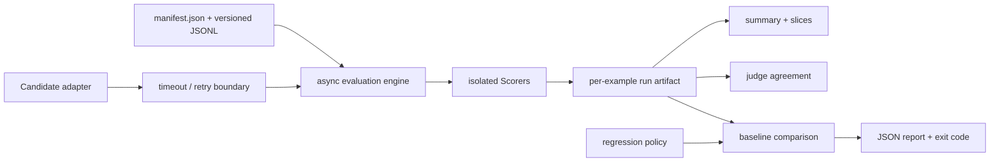

# evalreliability

`evalreliability` is a local-first Python evaluation harness for making stochastic model
and agent behavior testable with production-software rigor. It preserves per-example
evidence, treats partial failure as data, and turns explicit regression policy into a
machine-checkable exit status.

This is a working first version, not a hosted platform. Its built-in fixture adapter makes
the complete workflow deterministic in CI; real provider or agent integrations implement
the same asynchronous `Candidate` boundary. The checked-in measurements use fixtures and
small synthetic datasets and are not claims about model quality, production reliability,
or scale.

## What is implemented

- Versioned JSONL datasets with strict manifests, unique IDs, path confinement, and a
  canonical SHA-256 content identity.
- Provider-independent asynchronous candidates with typed failures, per-attempt timeouts,
  bounded exponential backoff, deterministic seeded jitter, and retained attempt history.
- Independent scorers for normalized exact match, required terms, JSON Schema, expected
  JSON fields, and configurable candidate-backed judging.
- Bounded concurrent evaluation with isolation at both example and scorer boundaries.
- JSON run artifacts with dataset/candidate/scorer/evaluation configuration, run and config
  IDs, timestamps, latency, optional token/cost usage, environment, and Git provenance.
- Derived reliability, failure-taxonomy, latency, scorer, and slice summaries.
- Baseline/candidate comparison with metric, slice, reliability, sample-size, and
  per-example policies; a failed policy exits with status `2`.
- Judge/reference agreement with coverage, confusion matrix, Cohen's kappa, disagreement
  records, slice analysis, and label-provenance warnings.
- A strict JSON-configured CLI and a small path-confined local FastAPI interface.
- Unit and integration tests for malformed output, candidate timeouts, retries, unexpected
  adapter exceptions, evaluator exceptions, partial results, concurrency, API confinement,
  artifact round trips, and regression exit behavior.

## Quickstart

Python 3.11 or newer is required.

```bash
python3 -m venv .venv
source .venv/bin/activate
python -m pip install -e '.[dev]'

evalrel validate-dataset examples/datasets/core/v1
evalrel run examples/configs/baseline.json \
  --output /tmp/baseline.run.json \
  --summary-output /tmp/baseline.summary.json
evalrel run examples/configs/candidate.json \
  --output /tmp/candidate.run.json \
  --summary-output /tmp/candidate.summary.json
evalrel compare \
  --baseline /tmp/baseline.run.json \
  --candidate /tmp/candidate.run.json \
  --policy examples/configs/regression-policy.json \
  --output /tmp/comparison.json
```

The comparison command returns `0` when policy passes, `3` when a quality or reliability
gate fails, and `1` for invalid configuration/artifacts or other operational errors. That
distinction reserves argparse's conventional status `2` for command-usage errors and lets
CI fail specifically on a measured regression.

Run the calibration-analysis example separately:

```bash
evalrel run examples/configs/judge_calibration.json \
  --output /tmp/judge-calibration.run.json
evalrel judge-agreement /tmp/judge-calibration.run.json \
  --scorer scripted_judge \
  --output /tmp/judge-agreement.json
```

## Architecture



The CLI and API are thin composition layers. Dataset loading, reliability behavior,
evaluation, serialization, analysis, and regression policy are separate package boundaries;
see [`docs/design.md`](docs/design.md) for contracts and trade-offs.

### Failure semantics

| Observation | Classification | Retried by engine | Example status |
| --- | --- | --- | --- |
| Typed refusal/content filter | model | only when adapter marks retryable | failed if no response |
| Malformed candidate JSON | model-quality score failure | no | completed |
| Judge output violates judge contract | evaluator | judge call may retry; parse does not | partial |
| Scorer exception or timeout | evaluator | no | partial |
| Candidate timeout/adapter exception | infrastructure | yes, within policy | failed if exhausted |

A failed quality score is not an operationally failed evaluation. For example, malformed
candidate JSON produces a `0` score plus a model failure record, while other scorers and
examples continue. Cancellation is propagated instead of being converted into a result.

## Dataset and configuration contracts

A dataset directory contains a manifest and JSONL records:

```json
{
  "schema_version": "1",
  "dataset_id": "support-routing",
  "version": "1.0.0",
  "data_file": "data.jsonl",
  "provenance": "How examples and labels were obtained"
}
```

```json
{"id":"ticket-001","input":"...","expected":{"text":"..."},"metadata":{"slices":{"domain":"support"}}}
```

Evaluation configuration is JSON so unknown fields and ambiguous values fail early. Paths
are resolved relative to the config file. The checked-in
[`candidate.json`](examples/configs/candidate.json) demonstrates all deterministic scorers;
[`judge_calibration.json`](examples/configs/judge_calibration.json) demonstrates a nested
judge candidate and separate retry policy.

The local API additionally confines all resolved paths to `--allowed-root` and rejects the
dynamic Python candidate factory. CLI configs are trusted local code/configuration and may
use a `python` candidate factory with `module:callable` syntax.

## Extending candidates and scorers

Candidates can represent one model call, a tool-using agent, a retrieval pipeline, or a
complete workflow:

```python
from evalreliability.candidates import Candidate
from evalreliability.models import CandidateRequest, CandidateResponse, Usage


class MyCandidate(Candidate):
    @property
    def identifier(self) -> str:
        return "my-system@revision"

    def configuration(self) -> dict[str, object]:
        return {"provider": "example", "temperature": 0}

    async def generate(self, request: CandidateRequest) -> CandidateResponse:
        result = await call_my_system(request.input)
        return CandidateResponse(
            output=result.text,
            model_id=result.model,
            usage=Usage(input_tokens=result.input_tokens, output_tokens=result.output_tokens),
        )
```

Expected provider/model errors should raise `CandidateError` with an explicit origin and
retryability. Unexpected exceptions are normalized as infrastructure failures. New scorers
subclass `Scorer`; a normal quality miss returns `ScoreOutcome.FAIL`, while an inability to
evaluate reliably raises `EvaluatorError`.

Configuration and artifacts must not contain secrets. Adapters are responsible for
returning redacted provenance from `configuration()`.

## Artifacts and analysis

Run artifacts are the source evidence. Summaries and comparisons are derived and can be
regenerated:

```bash
evalrel summarize examples/artifacts/candidate.run.json
evalrel compare \
  --baseline examples/artifacts/baseline.run.json \
  --candidate examples/artifacts/candidate.run.json \
  --policy examples/configs/regression-policy.json
```

Writes use a temporary file, `fsync`, and atomic replacement so readers never observe a
partial final JSON file. The artifact stores a stable configuration fingerprint separately
from the unique timestamped run ID. Per-example results retain candidate attempts, response,
usage, scorer details, normalized failures, and measured latency.

## Checked-in measurements

These values were actually produced on 2026-08-16 UTC with Python 3.14.3 on macOS, using
the six-example synthetic core dataset, in-process fixture candidates, seed `17`, and the
configuration committed here. Scorers have 2/6 coverage because each applies only to the
two examples carrying its expected field. Latencies are local orchestration measurements
and must not be interpreted as provider benchmarks.

| Metric | Baseline fixture | Candidate fixture | Delta |
| --- | ---: | ---: | ---: |
| Exact-match mean | 0.500000 | 1.000000 | +0.500000 |
| Required-terms mean | 0.833333 | 0.750000 | -0.083333 |
| JSON Schema mean | 0.500000 | 1.000000 | +0.500000 |
| JSON-fields mean | 0.500000 | 1.000000 | +0.500000 |
| Candidate-call success | 1.000000 | 1.000000 | 0.000000 |
| Example latency mean | 0.692 ms | 0.687 ms | -0.005 ms |

The baseline emitted two `malformed_json` model-quality records for one response. The
candidate emitted none, but it introduced one required-term regression: it said “JSON”
instead of the required “machine-readable.” The checked-in policy permits exactly one
per-example regression and a maximum `0.1` required-term aggregate drop, so the comparison
passes while retaining the negative result in
[`comparison.json`](examples/artifacts/comparison.json).

The scripted calibration fixture agreed with 7/8 synthetic specification labels: accuracy
`0.875`, Cohen's kappa `0.75`, with one over-credit on an explanation. This result only
exercises the agreement pipeline. The manifest records zero annotators and explicitly says
the labels are not human evaluation; the judge is scripted, not an LLM. See
[`judge-agreement.json`](examples/artifacts/judge-agreement.json).

## Local API

The API is intentionally synchronous and local; it is useful for invoking the same core
from another process, not presented as a durable service.

```bash
python -m pip install -e '.[api]'
evalrel serve --host 127.0.0.1 --port 8000 --allowed-root "$PWD"

curl -sS -X POST http://127.0.0.1:8000/v1/evaluations \
  -H 'content-type: application/json' \
  -d '{"config_path":"examples/configs/candidate.json"}'
```

`POST /v1/comparisons` accepts baseline/candidate artifact paths and an inline regression
policy. `GET /health` reports the package version.

## Development and verification

```bash
ruff check .
ruff format --check .
mypy src
pytest -q
```

CI runs these gates on Python 3.11, 3.12, and 3.13, followed by the deterministic example
smoke test. See [`CONTRIBUTING.md`](CONTRIBUTING.md) for extension expectations.

## Limitations

- Completed examples are held in memory until the final atomic write; a process crash loses
  progress because v1 has no checkpoint/resume protocol.
- Execution is bounded single-process `asyncio`, not a distributed scheduler.
- The package ships no vendor adapter. Real adapters must be supplied by users and tested
  against provider-specific rate limits, usage accounting, and error contracts.
- Regression metrics are descriptive point estimates. The tiny examples do not justify
  confidence, significance, or generalization claims.
- Judge analysis currently assumes one binary reference label. It does not represent
  multiple annotators, adjudication, ordinal rubrics, or reference uncertainty.
- The FastAPI endpoint performs work inline and has no authentication, queue, persistence,
  cancellation endpoint, or multi-tenant security model. Bind it locally.

Implementation findings and unresolved questions remain visible in
[`docs/engineering-log.md`](docs/engineering-log.md). They are not cleaned up to make the
project appear more mature than it is.

## License

MIT
