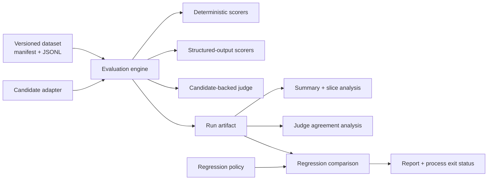

# Design: reliable evaluation for stochastic systems

## Design goals

`evalreliability` is designed to make stochastic model and agent behavior inspectable, comparable, and suitable for automated regression testing.

The core system:

* loads immutable, versioned JSONL datasets with validated manifests and content digests;
* evaluates asynchronous `Candidate` implementations through independent, composable `Scorer`s;
* preserves completed, partial, and failed example evidence;
* bounds candidate and scorer execution with explicit timeouts;
* classifies model/provider, evaluator, and infrastructure failures separately;
* retries only operations whose failure semantics permit retry;
* compares baseline and candidate runs through machine-readable regression policy;
* measures judge agreement against separately maintained reference labels;
* emits self-describing JSON artifacts with configuration, provenance, usage, latency, and environment metadata;
* exposes the same evaluation core through CLI and local API interfaces;
* verifies reliability behavior through deterministic unit and integration tests.

The implementation targets Python 3.11+ and local, single-host execution.

The data model and provider boundary are intentionally independent from a particular model vendor so additional transports, storage backends, or schedulers can be introduced without changing the evaluation contract.

## Architecture



The evaluation engine is the orchestration boundary.

Candidates produce responses. Scorers independently evaluate those responses. Run artifacts preserve the resulting execution evidence. Analysis and regression components operate on the artifacts rather than requiring another model invocation.

## Package boundaries

### `dataset`

Owns:

* manifest validation;
* path confinement;
* JSONL parsing;
* example-ID uniqueness;
* dataset content digests;
* focused dataset selection.

### `candidates`

Defines the provider-independent asynchronous candidate contract and implementations such as deterministic fixtures and immutable run replay.

### `claude_cli`

Owns the Claude Code subprocess adapter:

* isolated process invocation;
* envelope parsing;
* provider metadata normalization;
* usage extraction;
* provider failure classification.

### `scorers`

Contains deterministic, structured-output, schema, constraint, and candidate-backed judge scorers.

### `reliability`

Owns timeout, retry, backoff, and normalized invocation-failure behavior.

### `engine`

Coordinates bounded concurrent evaluation and preserves per-example isolation.

### `artifacts`

Owns stable serialization, artifact validation, and atomic persistence.

### `analysis`

Derives aggregates, reliability metrics, failure taxonomy, slice metrics, and judge/reference agreement.

### `annotations`

Owns resumable reference-label collection and aligned candidate/reference/judge analysis.

### `regression`

Aligns baseline and candidate runs and applies explicit regression policy.

### `config`

Loads strict JSON configuration and constructs built-in runtime components.

### `cli` and `api`

Provide interfaces over the same evaluation core. Evaluation semantics remain in the underlying package rather than in either interface.

## Candidate interface

The central candidate boundary is asynchronous:

```text
Candidate.generate(request) -> CandidateResponse
```

A candidate exposes its identifier and configuration separately from generation so persisted artifacts do not depend on Python object representation.

Expected model or provider failures use typed `CandidateError` values with explicit origin and retryability.

Unexpected adapter exceptions are normalized as infrastructure failures.

Candidate implementations may receive concurrent calls from multiple examples. Stateful implementations therefore need synchronization or an evaluation configuration whose concurrency is one.

## Claude CLI candidate

The Claude Code candidate invokes an argument array directly rather than through a shell.

Each invocation:

* uses the installed CLI's existing authenticated session;
* runs in a new empty temporary working directory;
* disables tools;
* reduces dynamic system-prompt context;
* uses an explicit process timeout;
* parses the JSON response envelope;
* retains provider-reported metadata when available.

The subprocess timeout and the evaluation engine's attempt timeout are separate boundaries.

Portable fields such as model ID, provider, finish status, token usage, and cost belong in the generic `CandidateResponse`.

Claude-specific fields remain in response metadata so the core candidate contract does not depend on one provider's envelope schema.

## Scorer interface

Scorers are asynchronous:

```text
Scorer.score(example, response) -> ScoreResult
```

Scorers run independently so one evaluator failure does not erase otherwise valid evidence for the example.

A normal quality miss returns a failed score.

For example, malformed JSON evaluated by a JSON scorer is a quality result rather than an execution exception.

Evaluator failures remain distinct. Examples include:

* an invalid judge verdict;
* a malformed rubric;
* a scorer timeout;
* an unexpected scorer exception.

This separation allows downstream analysis to distinguish candidate behavior from evaluation-system reliability.

## Example lifecycle

The engine stores one `ExampleResult` for each selected dataset example.

An example may finish as:

* `completed`: candidate execution succeeded and evaluation completed, even if one or more quality scores failed;
* `partial`: a response exists, but one or more evaluators could not produce valid results;
* `failed`: the candidate produced no scoreable response.

This status model keeps quality failures and operational failures separate.

## Bounded concurrency

Evaluation uses bounded `asyncio` concurrency.

The same engine can run multiple examples concurrently while preserving:

* independent candidate-attempt histories;
* independent scorer results;
* per-example latency;
* isolated failure evidence.

Candidate and scorer implementations are responsible for maintaining thread/task-safe mutable state when used concurrently.

## Retry and timeout semantics

Each candidate attempt receives its own timeout.

Retryable operations include failures explicitly classified as transient, candidate timeouts, and unexpected infrastructure failures when permitted by policy.

Quality failures such as invalid content or schema mismatch are scorer outcomes and do not cause the engine to regenerate the candidate response.

Backoff is exponential with optional deterministic jitter derived from:

* run seed;
* example ID;
* attempt number.

Attempt history is retained in the run artifact.

Scorers are also timeout-bounded.

Generic scorer retry is avoided because deterministic scorer failures usually indicate evaluator defects. Candidate-backed judges can instead own their model-call retry policy through the candidate boundary.

Cancellation propagates to the caller rather than being converted into an ordinary evaluation failure.

## Reference annotations

Reference labels are maintained separately from raw candidate-run artifacts.

An annotation artifact is bound to:

* a source run ID;
* the dataset checksum;
* the annotator identity;
* the collected labels.

Annotation collection does not overwrite or duplicate the original candidate response.

This separation allows model responses, human or operator references, and later judge output to retain distinct provenance.

## Run replay

The `run_artifact` candidate replays successful outputs from an immutable prior run.

Replay is useful when a later judge must evaluate exactly the response seen during reference annotation rather than generate a fresh stochastic output.

The replay adapter verifies dataset identity before accepting the run.

This prevents judge analysis from accidentally combining labels from one dataset execution with responses from another.

## Focused execution

A run may explicitly select a subset of example IDs.

Focused execution derives a dataset identity that includes:

* the parent dataset checksum;
* the ordered selected example IDs.

A one-example transport smoke run is therefore distinguishable from the full experiment even when both originate from the same versioned dataset.

## Regression comparison

Baseline and candidate runs can be compared only when the relevant evaluation semantics are compatible.

Scorer configuration is checked before comparison because changing a rubric, threshold, normalizer, or judge candidate can change the metric independently of candidate behavior.

Regression policy can evaluate:

* aggregate metrics;
* reliability;
* scorer coverage;
* slices;
* sample-size requirements;
* per-example changes.

Policy results are emitted as structured data and also drive the comparison command's process exit status.

## Reproducibility and provenance

Run artifacts capture the information needed to explain and compare executions.

This includes:

* dataset ID, version, and digest;
* candidate configuration;
* scorer configuration;
* effective evaluation configuration;
* start and end timestamps;
* run ID;
* configuration fingerprint;
* package version;
* Python version;
* platform metadata;
* Git provenance;
* attempt-level latency;
* example-level latency;
* token and cost fields when supplied by an adapter.

The configuration fingerprint is a SHA-256 digest over canonical dataset, candidate, scorer, and engine configuration.

The run ID combines a UTC timestamp with a prefix of that fingerprint.

Equivalent configurations therefore retain a stable configuration identity while individual executions still receive distinct run IDs.

Timestamps and observed latency remain execution-specific.

## Secret handling

Artifacts are designed to contain configuration and provenance rather than credentials.

Candidate adapters return redacted configuration.

An adapter may record the name of an environment variable used for configuration, but not its secret value.

## Artifact persistence

The engine produces one final run artifact after evaluation.

Persistence uses:

1. a temporary file;
2. JSON serialization;
3. flush;
4. `fsync`;
5. atomic replacement.

Readers therefore see either the prior artifact or the complete replacement rather than a partially written final file.

The current execution model retains in-progress example state in memory. A future checkpointing implementation can extend the persistence layer while preserving the existing run-artifact contract.

## Judge evaluation

A candidate-backed judge uses the same candidate reliability boundary as other model-backed systems.

Judge analysis preserves:

* raw judge output;
* parsed verdict;
* candidate/provider metadata;
* attempt history;
* usage;
* latency;
* invalid-output evidence.

Reference labels and judge output remain separate inputs to agreement analysis.

Agreement metrics can include:

* paired coverage;
* confusion matrix;
* accuracy;
* Cohen's kappa;
* slice-level results;
* disagreement records.

Experiment-specific sample sizes and interpretation constraints remain with the corresponding experiment artifacts and documentation.

## Design trade-offs

### JSON configuration

JSON provides strict scalar semantics and keeps configuration loading deterministic.

### Final atomic artifact

Writing one complete artifact keeps the persistence model simple and makes the finished run internally coherent.

### Single-process async execution

Bounded `asyncio` provides concurrent evaluation while keeping scheduling and failure semantics directly inspectable.

### Standards-based JSON Schema

Schema scoring uses the `jsonschema` library rather than maintaining a partial custom implementation.

### Deterministic fixtures

Fixture candidates provide reproducible CI and allow timeout, retry, malformed-output, and regression behavior to be tested without external model calls.

### Explicit real-model execution

Real Claude CLI configurations are separate from deterministic CI paths so model usage occurs only when explicitly invoked.

## Extension boundaries

The current architecture provides stable interfaces for extending:

* model and agent candidates;
* provider transports;
* retrieval or workflow candidates;
* scorer families;
* reference-label workflows;
* checkpointing;
* storage;
* statistical analysis;
* scheduling.

Those extensions can build on the existing dataset, candidate, scorer, artifact, and regression contracts without changing the basic evaluation flow.
