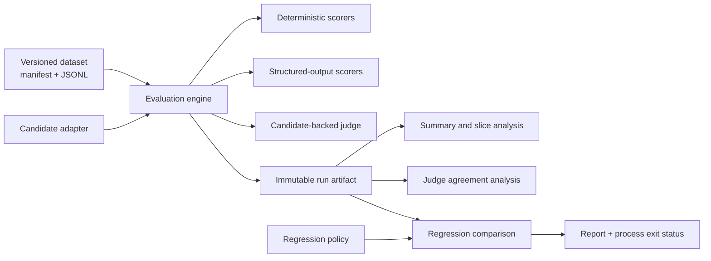

# Design: reliable evaluation for stochastic systems

## Requirements

The first release must:

- load immutable, versioned JSONL datasets with validated manifests and content digests;
- evaluate any asynchronous `Candidate` through independent, composable `Scorer`s;
- preserve every example result, including partial and failed work;
- bound candidate and scorer calls with timeouts, isolate failures, and retry only calls
  classified as retryable;
- distinguish model-quality, evaluator, and infrastructure failures in artifacts;
- compare baseline and candidate runs using explicit, machine-readable regression policy;
- measure judge agreement against labeled references without treating a judge as truth;
- emit self-describing JSON artifacts with configuration, provenance, usage, latency,
  and environment metadata;
- expose the same core through a CLI and a small local FastAPI surface; and
- prove failure behavior with unit and integration tests.

The implementation targets Python 3.11+ and local/single-host execution. The data model
and provider boundary should remain useful if storage or scheduling later moves elsewhere.

## Non-goals

- Distributed scheduling, a hosted control plane, or Kubernetes integration.
- A provider SDK matrix. Provider integrations belong behind `Candidate`; the core must
  not depend on one vendor's request or response types.
- Statistical significance from tiny example datasets.
- Treating exact-match scores, reference labels, or LLM judges as universal ground truth.
- Reconstructing a run bit-for-bit when a remote model is nondeterministic. We record the
  inputs needed to explain and compare runs; we do not promise determinism a provider
  cannot supply.

## Architecture

Package boundaries:

- `dataset`: manifest/path validation, JSONL parsing, uniqueness checks, digesting.
- `candidates`: provider-independent request/response contract and local fixture adapter.
- `scorers`: deterministic, schema, and candidate-backed judge implementations.
- `reliability`: timeout/retry invocation and normalized failure classification.
- `engine`: concurrent orchestration and per-example isolation.
- `artifacts`: stable serialization and atomic persistence.
- `analysis`: aggregates, failure taxonomy, slices, and judge/reference agreement.
- `regression`: baseline/candidate alignment and policy enforcement.
- `config`: strict JSON configuration and construction of built-in components.
- `cli` / `api`: thin interfaces; neither owns evaluation logic.

## Important interfaces

`Candidate.generate(request) -> CandidateResponse` is asynchronous. A candidate reports
its identifier/configuration separately so artifacts do not depend on Python object
representations. Expected model/provider failures use a typed `CandidateError`; an
unexpected adapter exception is infrastructure failure.

Candidates and scorers may receive concurrent calls from multiple examples. Implementations
with mutable state must synchronize it or explicitly configure evaluation concurrency to one.

`Scorer.score(example, response) -> ScoreResult` is asynchronous. A normal quality miss
returns a failed score, not an exception. Malformed candidate output is a model-quality
failure attached to that score. A broken rubric, judge parse failure, or scorer exception
is an evaluator failure and does not discard other scorer results.

Regression comparison rejects changed scorer configurations by default. Comparing metrics
from different rubrics, thresholds, normalizers, or judge candidates is otherwise not a
candidate regression measurement.

The engine stores one `ExampleResult` per dataset example. `completed` means evaluation
ran to completion even if quality scores failed; `partial` means one or more evaluators
failed; `failed` means the candidate produced no scoreable response.

## Retry and timeout semantics

- Each candidate attempt has an independent timeout.
- Only typed retryable candidate errors, timeouts, and unexpected adapter/infrastructure
  exceptions are retried. Content/schema quality failures are score outcomes and are not
  retried by the engine.
- Backoff is exponential with optional deterministic jitter derived from run seed,
  example ID, and attempt number. Attempt history is persisted.
- Scorers are timeout-bounded but not generically retried: deterministic scorer retries
  hide bugs, while model judges own their candidate-call retry policy explicitly.
- Cancellation is never converted into a normal failure.

## Reproducibility and provenance

Every artifact contains dataset ID/version/digest, candidate and scorer configurations,
the effective evaluation configuration, start/end timestamps, a run ID, a deterministic
configuration fingerprint, package/Python/platform/Git metadata, per-attempt latency,
per-example latency, and token/cost fields when adapters supply them.

The configuration fingerprint is a SHA-256 digest of canonical dataset, candidate,
scorer, and engine configuration. The run ID combines a UTC timestamp with a prefix of
that fingerprint, making distinct executions visible while preserving a stable key for
equivalent configurations. Timestamps and observed latency are intentionally not
deterministic.

Artifacts exclude secrets. Candidate adapters must return redacted configuration and may
identify environment-variable names, never their values.

## Major trade-offs

- JSON is the only configuration format in v1. It is less ergonomic than YAML but avoids
  ambiguous scalar parsing and another core dependency.
- The engine writes one final JSON artifact atomically rather than streaming results.
  This keeps the first implementation understandable but means a process crash can lose
  the in-memory run; checkpointed JSONL is a planned extension.
- Concurrency is bounded `asyncio` on one process. This is sufficient to test semantics
  without pretending to provide distributed durability.
- JSON Schema uses the standards-based `jsonschema` library rather than a partial custom
  validator.
- Built-in fixtures make CI and the quickstart deterministic. They validate orchestration,
  not remote-model quality or provider reliability.

## Open engineering questions

These remain intentionally visible until measurements justify a choice:

1. Should large runs checkpoint each example to append-only JSONL, and how should resume
   reconcile scorer/config changes?
2. What minimum sample sizes and uncertainty intervals should regression policies require
   before blocking on slice-level deltas?
3. How should judge calibration represent multiple annotators, adjudication, and label
   uncertainty without collapsing disagreement into a single target?
